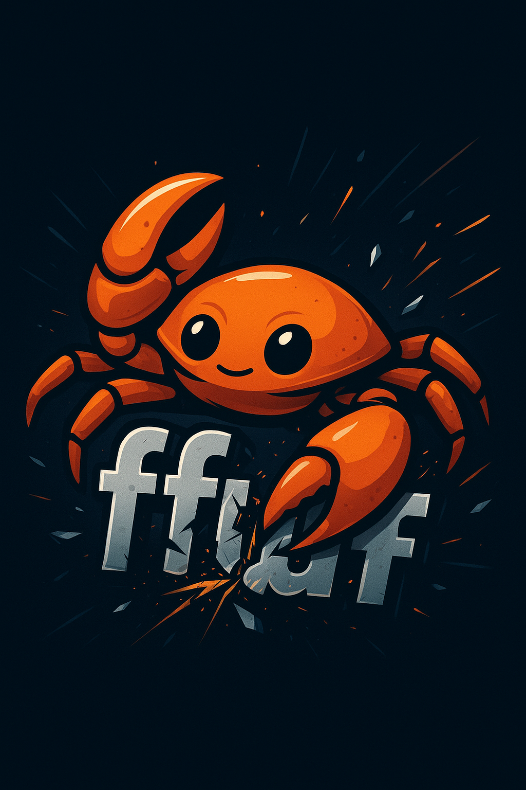

<div align="center">

# 🚀 FuzzBlitz



<p>
  <strong>Lightning-fast web fuzzer</strong> built with 
</p>

<p>
  <code>ffuf compatible</code> • Multi-threaded • Smart filtering • Beautiful output
</p>

[](https://www.rust-lang.org/)
[](LICENSE)

</div>

---

## ⚡ Quick Start

```bash
# Install
git clone https://github.com/ibrahmsql/fuzzblitz.git
cd fuzzblitz
cargo build --release

# Run
./target/release/fuzzblitz -u https://example.com/FUZZ -w wordlist.txt
```

---

## 🎯 Features

### Core Fuzzing
- ⚡ **Multi-threaded** - Up to 100+ concurrent threads
- 🎨 **Beautiful output** - Colored results with real-time progress
- 🔍 **Smart filtering** - Status codes, size, lines, words, regex, time
- 🔄 **Fuzzing modes** - Clusterbomb, Pitchfork, Sniper
- 📦 **Extension fuzzing** - Auto-append .php, .html, .bak, .old
- 🎯 **Encoders** - URL, Base64, Hex, double encoding

### Advanced Features
- 🔐 **WAF Bypass** - Random User-Agent, header variations, IP rotation
- 🤖 **CAPTCHA Detection** - reCAPTCHA, hCaptcha, Cloudflare challenges
- 🕵️ **Stealth Mode** - Adaptive delays, auto-pause, smart throttling
- 🔒 **Auth Testing** - Basic, Bearer, Digest, NTLM, JWT support
- 🌐 **API Fuzzing** - REST, GraphQL, WebSocket, Swagger/OpenAPI
- 🧪 **Security Testing** - CORS, XSS, SQLi, Open Redirect, Subdomain Takeover
- 🔌 **Plugin System** - 9 built-in plugins + custom plugin support

### Output & Integration
- 📊 **Multiple formats** - JSON, CSV, HTML, Markdown
- 🌐 **Protocol support** - HTTP/2, HTTPS, proxies (HTTP/SOCKS5)
- 📡 **Custom headers** - Cookies, authorization, content-type
- 💾 **Session replay** - Save and replay attack sessions
- 📈 **Job management** - Multi-job queue and control

---

## 💡 Examples

### Basic directory fuzzing
```bash
fuzzblitz -u https://target.com/FUZZ -w wordlist.txt
```

### Filter 404s
```bash
fuzzblitz -u https://target.com/FUZZ -w wordlist.txt --fc 404
```

### POST data fuzzing
```bash
fuzzblitz -u https://target.com/login \
  -X POST \
  -d '{"user":"FUZZ","pass":"test"}' \
  -w users.txt
```

### Multiple wordlists
```bash
fuzzblitz -u https://target.com/USER/PASS \
  -w users.txt:USER \
  -w passwords.txt:PASS \
  --mode clusterbomb
```

### With extensions
```bash
fuzzblitz -u https://target.com/FUZZ \
  -w files.txt \
  -e .php,.html,.bak
```

---

## 🎛️ Common Options

| Option | Description |
|--------|-------------|
| `-u, --url` | Target URL (use FUZZ keyword) |
| `-w, --wordlist` | Wordlist file path |
| `-t, --threads` | Number of threads [default: 40] |
| `-X, --method` | HTTP method [default: GET] |
| `-H, --header` | Custom header |
| `-d, --data` | POST data |
| `--mc` | Match status codes [default: all] |
| `--fc` | Filter status codes |
| `--fs` | Filter response size |
| `-e, --extensions` | File extensions |
| `-o, --output` | Output file |
| `-c, --color` | Colorize output |
| `-v, --verbose` | Verbose mode |

<details>
<summary>📖 See all options</summary>

### Matcher Options
- `--mc` - Match status codes
- `--ml` - Match line count
- `--mr` - Match regex
- `--ms` - Match response size
- `--mw` - Match word count
- `--mt` - Match response time

### Filter Options
- `--fc` - Filter status codes
- `--fl` - Filter line count
- `--fr` - Filter regex
- `--fs` - Filter response size
- `--fw` - Filter word count
- `--ft` - Filter response time

### Advanced Options
- `--mode` - Fuzzing mode: clusterbomb, pitchfork, sniper
- `--enc` - Encoders: urlencode, b64encode, hexencode
- `--delay` - Delay between requests
- `--rate` - Requests per second limit
- `--proxy` - Proxy URL
- `--timeout` - Request timeout [default: 10s]

</details>

---

## 🔄 Fuzzing Modes

- **Clusterbomb** - All combinations (cartesian product)
- **Pitchfork** - Parallel iteration (1-to-1)
- **Sniper** - Single wordlist through positions

---

## 📦 Installation

### From source
```bash
git clone https://github.com/ibrahmsql/fuzzblitz.git
cd fuzzblitz
cargo build --release
```

### Using Cargo
```bash
cargo install fuzzblitz
```

---

## FuzzBlitz vs ffuf

| Feature | ffuf | FuzzBlitz |
|---------|------|-----------|
| URL Fuzzing | ✅ | ✅ |
| Multi-threading | ✅ | ✅ |
| Filtering/Matching | ✅ | ✅ |
| **WAF Bypass** | ❌ | ✅ |
| **CAPTCHA Detection** | ❌ | ✅ |
| **Stealth Mode** | ❌ | ✅ |
| **Auth Testing** | ❌ | ✅ (5 types) |
| **API/GraphQL** | ❌ | ✅ |
| **WebSocket** | ❌ | ✅ |
| **Security Tests** | ❌ | ✅ |
| **Plugin System** | ❌ | ✅ |

**FuzzBlitz = ffuf + 150 extra features**

---

## 📄 License

MIT License - see [LICENSE](LICENSE) file

---

## 🙏 Credits

- Inspired by [ffuf](https://github.com/ffuf/ffuf)
- Built with Rust 🦀
- Created by [@ibrahimsql](https://github.com/ibrahimsql)

---

<div align="center">

**Happy Fuzzing! 🎯**

⭐ Star this repo if you find it useful!

</div>
